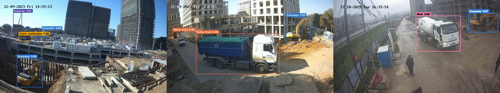
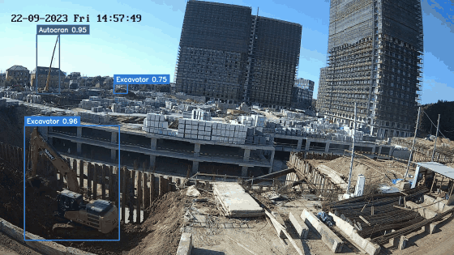
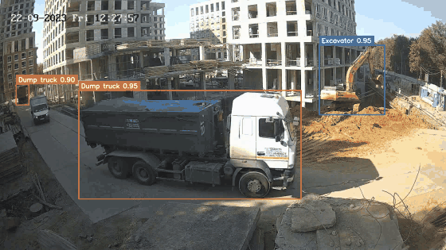
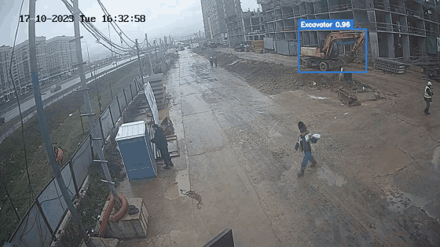
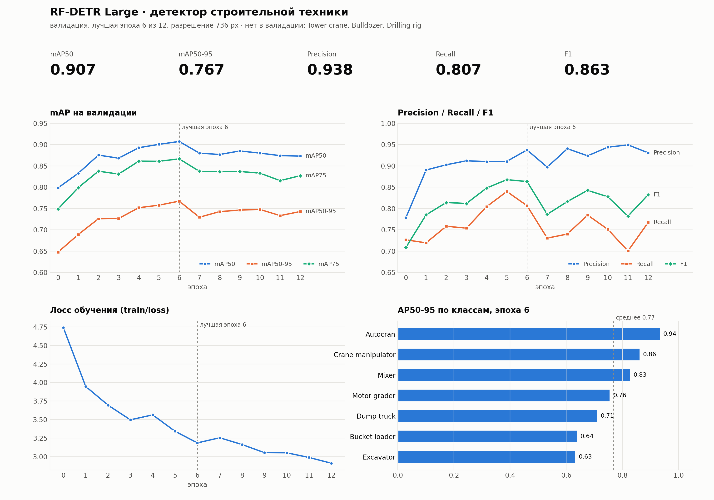
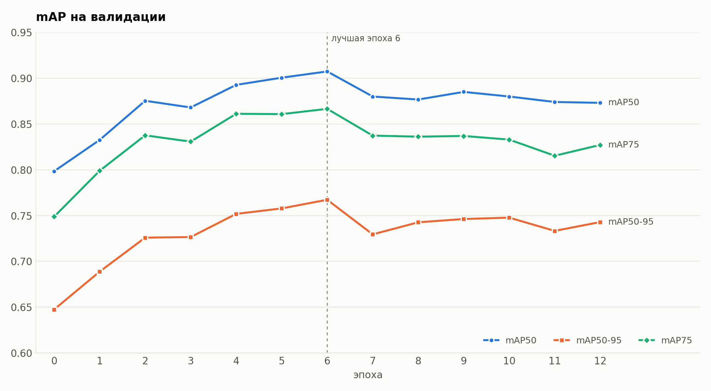
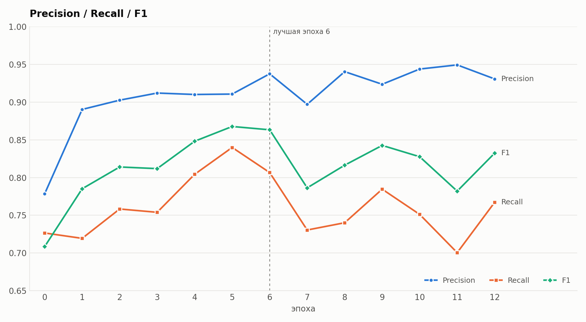
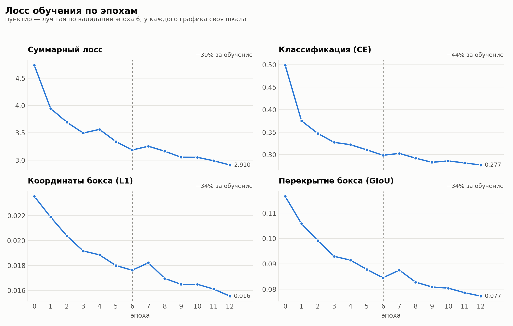
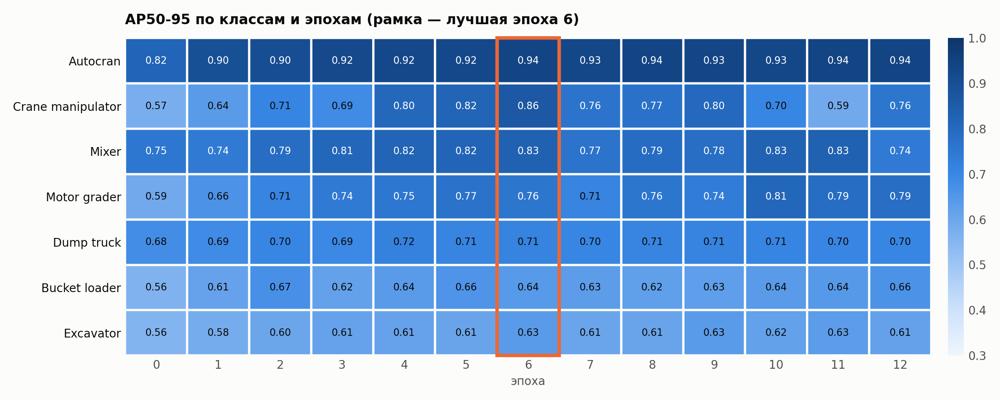

# Детектор для интеллектуальной системы мониторинга строительной площадки

Интеллектуальная система, которая по видео со строительной площадки оценивает соответствие
фактически выполняемых строительно-монтажных работ календарному плану на основании сведений
о наличии и поведении строительной техники.

Первый модуль — детектор строительной техники **RF-DETR Large** (736 px, mAP50 ≈ 0.91 на валидации).

<p align="center"></p>

<p align="center">
  <b>mAP50 0.907</b> · mAP50-95 0.767 · Precision 0.938 · Recall 0.807 · 10 классов техники
</p>

## Как это работает


Детектор находит технику на каждом кадре. Из покадровых детекций собирается картина присутствия:
какая техника, сколько единиц, в какие интервалы времени работала на площадке. Эти данные дальше
сравниваются с календарным планом: например, по графику идут земляные работы, а экскаватора
в кадре нет — это отклонение. Пунктиром на схеме отмечены следующие этапы.

## Результаты на видео

Три камеры, разные участки и условия съёмки.

### Котлован: экскаваторы и автокран

<p align="center"></p>

### Земляные работы: экскаватор и самосвалы

<p align="center"></p>

### Подъезд к площадке: бетономешалка

<p align="center"></p>

### Сводка по видео

| видео | техника | доля времени в кадре | максимум одновременно | средняя уверенность |
|---|---|---|---|---|
| 1325_20230922_144430_014 | Excavator | 100% | 2 | 0.87 |
| | Autocran | 100% | 1 | 0.93 |
| | Crane manipulator | 5% | 1 | 0.83 |
| 238_20230922_122759_037 | Excavator | 100% | 1 | 0.95 |
| | Dump truck | 95% | 2 | 0.95 |
| 2501_20231017_163235_135 | Excavator | 100% | 1 | 0.95 |
| | Mixer | 64% | 1 | 0.95 |

Так выглядит `outputs/inference/summary.csv` — готовая таблица для сопоставления с графиком работ.

Материалы для этого раздела собираются автоматически по результатам инференса:

```bash
python scripts/run_inference.py        # детекция на всех видео
python scripts/make_showcase.py        # кадры и GIF -> reports/showcase/
```

## Структура

```
├── configs/
│   └── inference.yaml          # веса, порог, glob-шаблоны видео, настройки вывода и бенчмарка
├── data/
│   └── videos/                 # сюда кладём видео (можно в подпапки по камерам/датам)
├── weights/
│   ├── rfdetr_large_best_ema.pth   # веса для инференса
│   └── checkpoints/            # чекпоинты Lightning (*.ckpt) — только для дообучения
├── src/construction_monitor/   # общий код
│   ├── config.py               # загрузка конфига, пути от корня репозитория
│   ├── detector.py             # загрузка RF-DETR и предсказание на кадрах
│   ├── video.py                # поиск видео через glob, чтение кадров, запись видео
│   └── results.py              # отрисовка боксов, CSV детекций, сводка по технике
├── scripts/
│   ├── run_inference.py        # обычный инференс: видео с боксами + CSV + сводка
│   ├── benchmark_inference.py  # замер скорости (FPS, задержка p50/p95, память GPU)
│   ├── plot_train_metrics.py   # графики метрик обучения -> reports/plots/*.png
│   └── make_showcase.py        # кадры и GIF по результатам -> reports/showcase/
├── train/
│   └── train_rfdetr.py         # обучение детектора
├── reports/
│   ├── rfdetr_large_train_metrics.csv  # метрики обучения
│   ├── plots/                  # графики: mAP, P/R/F1, лосс, AP по классам
│   └── showcase/               # примеры детекции: кадры и GIF
└── outputs/                    # результаты запусков (не в git)
```

## Установка

```bash
python -m venv .venv
.venv\Scripts\activate            # Linux/macOS: source .venv/bin/activate

# PyTorch под свою CUDA, см. https://pytorch.org/get-started/locally/
pip install torch torchvision --index-url https://download.pytorch.org/whl/cu124
pip install -r requirements.txt
```

Веса в git не хранятся: положите `rfdetr_large_best_ema.pth` в `weights/`.

## Классы

Список классов хранится в самом чекпоинте, в коде он не задаётся:

`Dump truck, Excavator, Motor grader, Tower crane, Bulldozer, Bucket loader, Mixer,
Crane manipulator, Autocran, Drilling rig`

## Инференс

Положите видео в `data/videos/` (или укажите свои шаблоны) и запустите из корня репозитория:

```bash
python scripts/run_inference.py
```

Без аргументов видео ищутся через `glob` по шаблонам из `configs/inference.yaml` (`videos.patterns`).
Можно передать файл, папку или glob-шаблон. Если передано только имя файла, он ищется в `data/videos/`:

```bash
python scripts/run_inference.py 1325_20230922_144430_014.mp4     # одно видео из data/videos
python scripts/run_inference.py D:/cameras/cam1/video.mp4        # любой путь
python scripts/run_inference.py D:/cameras/cam1                  # вся папка
python scripts/run_inference.py "D:/cameras/**/*.mp4" --stride 5 --threshold 0.4
python scripts/run_inference.py --device cpu --no-video          # только CSV и сводка
python scripts/run_inference.py --show                           # смотреть в окне, q — следующее видео
```

Результат на каждое видео — `outputs/inference/<имя_видео>/`:

| файл | что внутри |
|---|---|
| `annotated.mp4` | видео с боксами и уверенностью |
| `detections.csv` | `video, frame, time_s, class_id, class_name, confidence, x1, y1, x2, y2` |
| `summary.json` | по каждому классу: доля кадров с техникой, секунды присутствия, первое/последнее появление, максимум единиц одновременно, средняя уверенность |

Плюс общая таблица `outputs/inference/summary.csv` по всем видео — из неё дальше строится сопоставление
с календарным планом (какая техника и сколько времени реально работала на площадке).

## Замер скорости

```bash
python scripts/benchmark_inference.py                              # fp32, батч 1
python scripts/benchmark_inference.py --optimize --half --batch 4  # JIT + fp16 на GPU
python scripts/benchmark_inference.py --draw --max-frames 0        # все кадры, с отрисовкой
```

Скрипт прогревает модель, затем раздельно меряет декодирование кадра, инференс
(предобработка + модель + постобработка) и отрисовку. Выводит FPS модели и сквозного конвейера,
задержку mean/p50/p95 и пик памяти GPU. Отчёт — `outputs/benchmark/benchmark_<дата>.json` и `.csv`.

## Основные параметры

| флаг | конфиг | по умолчанию | описание |
|---|---|---|---|
| файлы / папки / шаблоны (или `--videos`) | `videos.patterns` | `data/videos/**/*.mp4` и др. | что обрабатывать |
| `--stride` | `videos.frame_stride` | 1 | брать каждый N-й кадр |
| `--threshold` | `model.threshold` | 0.4 | порог уверенности |
| `--device` | `model.device` | auto | `cuda`, `cuda:1`, `cpu` |
| `--optimize` | `model.optimize` | false | JIT-трассировка модели |
| `--half` | `model.half` | false | fp16 (только CUDA) |
| `--batch` | `benchmark.batch_size` | 1 | кадров за вызов модели |

## Метрики обучения



Лучшая эпоха — 6 из 12 (по mAP50-95), её веса лежат в `weights/rfdetr_large_best_ema.pth`.
Tower crane, Bulldozer и Drilling rig есть в модели, но не встречались в валидации — качество по ним не измерено.

<table>
  <tr>
    <td></td>
    <td></td>
  </tr>
  <tr>
    <td align="center">mAP растёт до 6-й эпохи, дальше проседает — сработал early stopping</td>
    <td align="center">Precision высокий (0.94), recall ниже (0.81): модель скорее пропустит технику, чем ошибётся</td>
  </tr>
</table>



Лосс продолжает падать и после 6-й эпохи, а качество на валидации — нет: начало переобучения.



Лучше всего модель находит автокраны (0.94), хуже всего — экскаваторы и погрузчики (0.63–0.64):
их в первую очередь стоит доразмечать.

Графики строятся из CSV-лога обучения:

```bash
python scripts/plot_train_metrics.py                                   # reports/rfdetr_large_train_metrics.csv
python scripts/plot_train_metrics.py --csv runs/rfdetr/metrics.csv     # после нового обучения
```

| файл в `reports/plots/` | что на нём |
|---|---|
| `00_overview.png` | сводка: ключевые цифры, mAP, P/R/F1, лосс, AP по классам |
| `01_map.png` | mAP50 / mAP50-95 / mAP75 по эпохам |
| `02_precision_recall.png` | precision / recall / F1 по эпохам |
| `03_loss.png` | суммарный лосс и составляющие: классификация, L1, GIoU |
| `04_class_ap_best.png` | AP50-95 по классам на лучшей эпохе |
| `05_class_ap_heatmap.png` | AP50-95 по классам и эпохам |
| `best_epoch.json` | все метрики лучшей эпохи |

## Обучение

```bash
python train/train_rfdetr.py --data C:\ml\dataset --model large --resolution 736
```

Лучший чекпоинт (`checkpoint_best_ema.pth` / `checkpoint_best_total.pth`) скопируйте в `weights/`
и укажите его в `configs/inference.yaml`.
