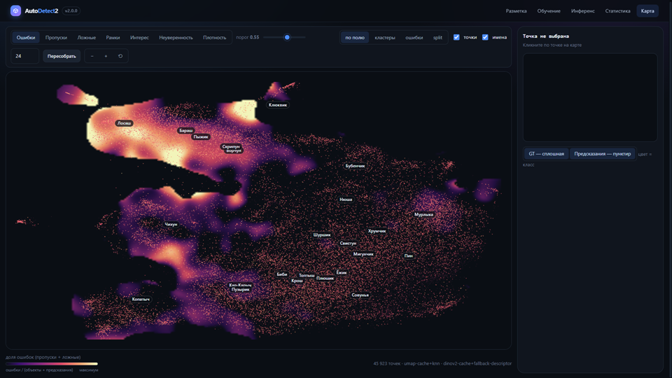

# AutoDetect2 - фреймворк для авторазметки

<p align="center"></p>

Система оценивает по фотографиям со стройплощадки, идут ли строительно-монтажные
работы по графику, — опираясь на присутствие и поведение строительной техники.

Внутри репозитория лежит **AutoDetect2** — рабочее место разметчика: авторазметка,
поиск выбросов в существующей разметке, активный отбор кадров, деление на train/val,
передача заданий напарнику и сборка кода обучения YOLO.

```bash
pip install -r requirements.txt
python app.py                 # http://127.0.0.1:8000
```

Подробности — [docs/AUTODETECT2.md](docs/AUTODETECT2.md).

## Классы

| id | класс | id | класс |
|---|---|---|---|
| 0 | Dump truck | 5 | Bucket loader |
| 1 | Excavator | 6 | Mixer |
| 2 | Motor grader | 7 | Crane manipulator |
| 3 | Tower crane | 8 | Autocran |
| 4 | Bulldozer | 9 | Drilling rig |

## Структура

```
app.py                  точка входа (работает и как `uvicorn app:app`)
autodetect2/            приложение: backend · frontend · autofile
docs/                   документация
tools/                  служебные скрипты
workspace/              проекты, кэш, экспорты — не в git
images/ labels/         данные — не в git
```

Датасет в репозиторий не попадает: всё, что относится к данным, весам и рабочему
пространству, перечислено в [.gitignore](.gitignore).
