# Интеллектуальный мониторинг строительной площадки

По одному кадру со стройки система определяет **стадию работ**, **готовность объекта 0–100%**, сверяет её
с **календарным планом** и показывает, на чём основан каждый вывод: карта внимания, техника и объекты на кадре,
похожие кадры других строек и независимая проверка визуально-языковой моделью.

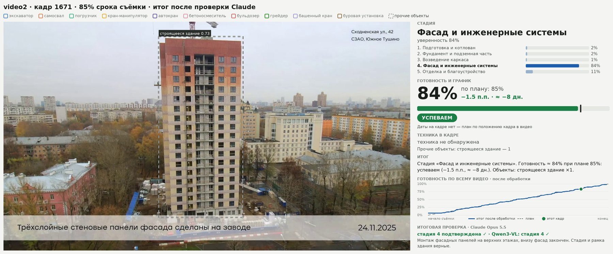

| 0.9 п.п. | 99.7% | 0.907 |
|:---:|:---:|:---:|
| средняя ошибка готовности | точность стадии | mAP50 детектора техники |

## Как это работает

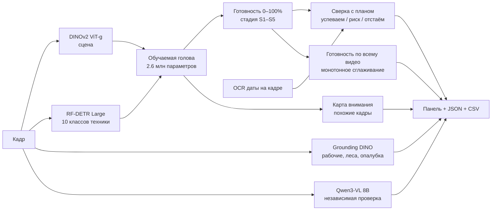

Большие модели заморожены: признаки считаются один раз, голова обучается за минуту. Готовность стройки
со временем не убывает, поэтому кривая готовности по всему видео сглаживается изотонической регрессией.
Стадии: **S1** подготовка и котлован · **S2** фундамент · **S3** каркас · **S4** фасад и инженерные системы ·
**S5** отделка и благоустройство.

## Итоговый результат

**Готовность по всему видео и отклонение от плана.** Бледная линия — прогноз головы по каждому кадру, синяя —
итог после монотонного сглаживания, пунктир — план. Снизу — отклонение итога от плана в процентных пунктах.
Кружки с номерами — примеры из раздела ниже.


| видео | кадров | ошибка по кадрам | ошибка итога | точность стадии |
|---|---:|---:|---:|---:|
| video1 | 1 200 | 1.1 п.п. | **0.8 п.п.** | 99.6% |
| video2 | 1 200 | 1.3 п.п. | **1.1 п.п.** | 99.9% |
| video3 | 1 092 | 1.4 п.п. | **1.0 п.п.** | 99.6% |
| video4 | 1 200 | 1.0 п.п. | **0.8 п.п.** | 99.5% |
| **все** | **4 692** | **1.2 п.п.** | **0.9 п.п.** | **99.7%** |

<table>
<tr>
<td width="62%">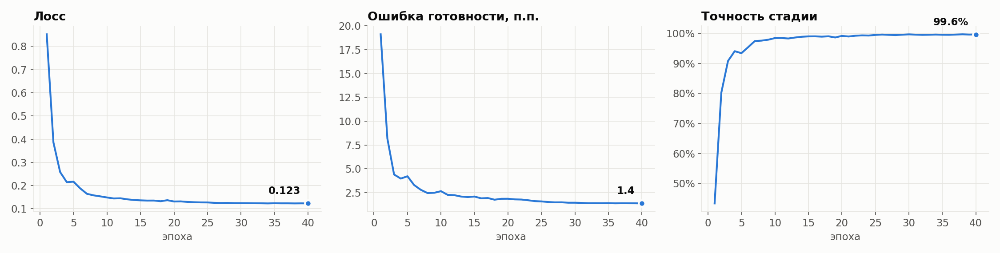</td>
<td width="38%">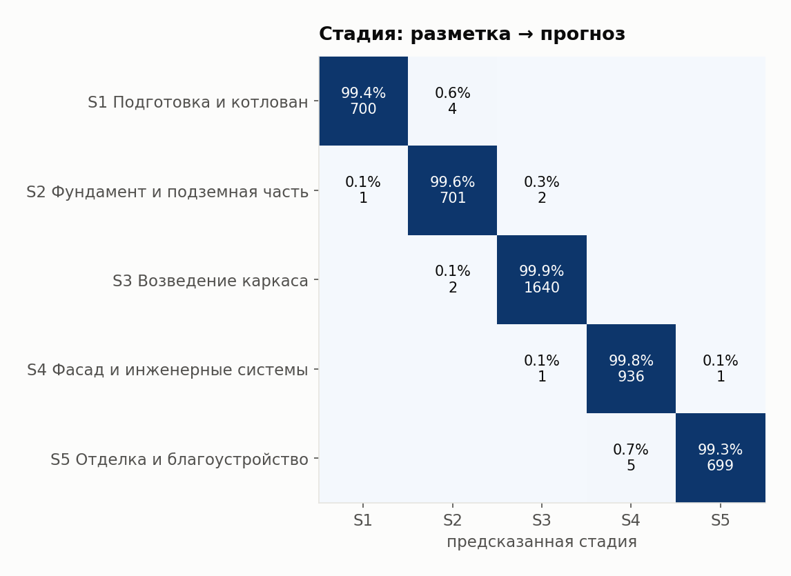</td>
</tr>
</table>

## Примеры: итоговый результат

Итоговые панели — вывод моделей после проверки Claude. Слева кадр с рамками: техника (RF-DETR) — с уверенностью
модели, прочие объекты — пунктиром, объекты, отмеченные проверкой, — с пометкой «Claude»; ложные рамки сняты.
Справа стадия, готовность против плана (со сглаженной кривой всего видео), статус в процентных пунктах и днях,
итог, график готовности по всему видео и итоговая проверка со сверкой с Qwen3-VL. Примеры 4 и 5 — одна и та же
стройка (video4) в начале и в конце съёмки. Исходный вывод моделей по каждому кадру — панели, карты внимания,
JSON и сводный CSV — в [predictions/20260925_212142](predictions/20260925_212142).

**Пример 1** · video1, 85% срока — фасад
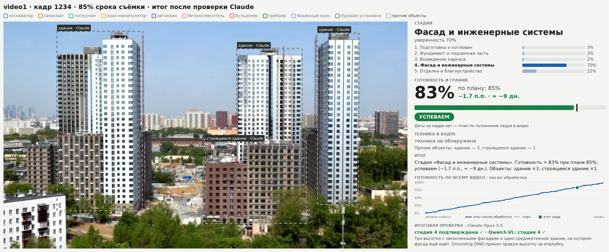

**Пример 2** · video2, 85% срока — фасад


**Пример 3** · video3, 85% срока — фасад
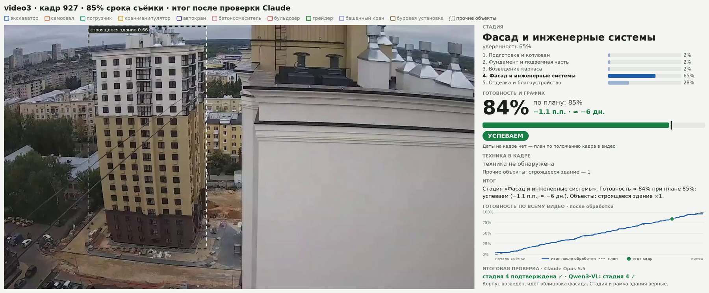

**Пример 4** · video4, 15% срока — фундамент
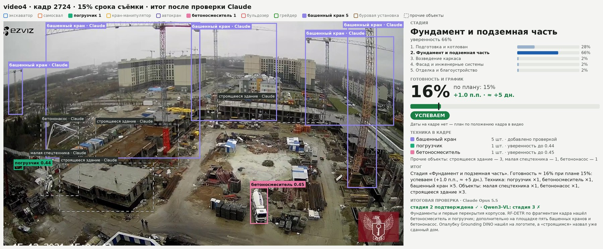

**Пример 5** · video4, 85% срока — отделка и благоустройство
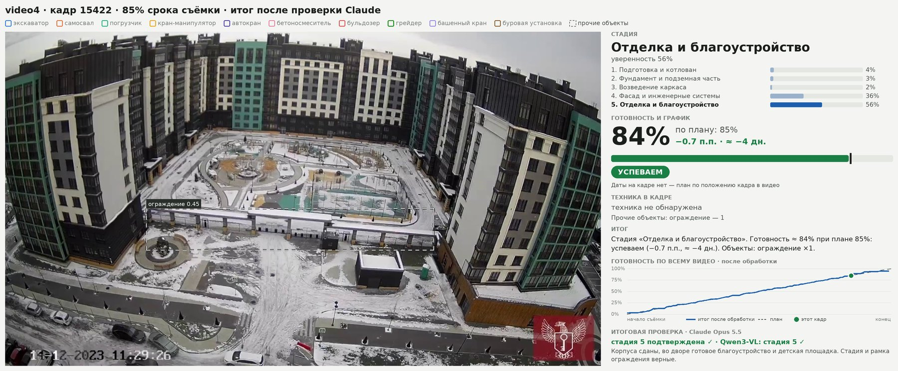

**Куда смотрела модель.** Карта внимания головы по сетке 9×16: в обоих примерах модель смотрит на фасад
строящегося корпуса — на ещё не законченные этажи, которые и отличают стадию «фасад» от «отделки».

<table>
<tr>
<td>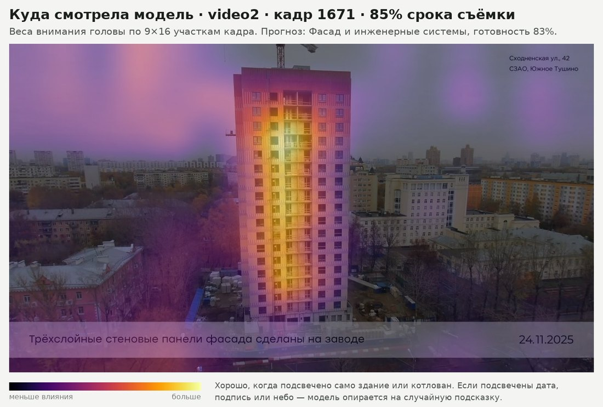</td>
<td>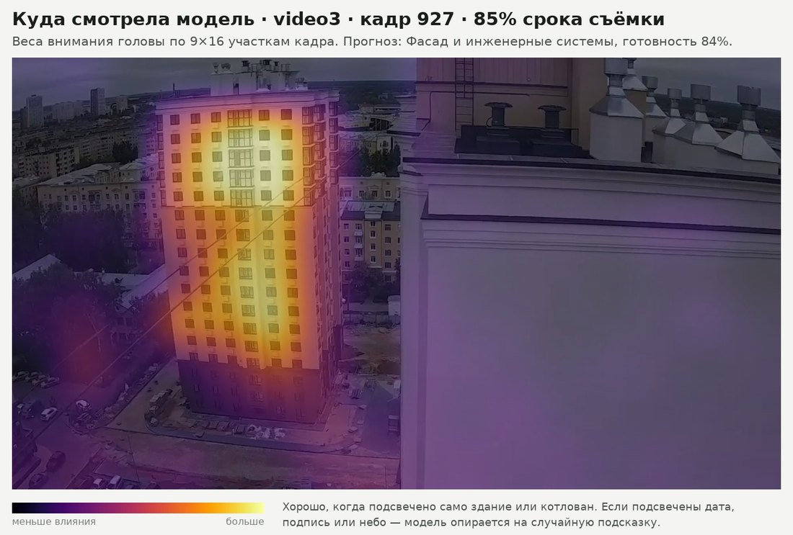</td>
</tr>
</table>

## Проверка кадров Claude

Каждый пример дополнительно просмотрен Claude Opus 5.5: стадия, объекты и дата на кадре. Рамки, которые проверка
признала ложными, сняты с итоговых панелей; слева на картинках «до/после» виден исходный вывод моделей.
Разметка лежит в [docs/claude_review.json](docs/claude_review.json).

| пример | план / итог | стадия модели | Qwen3-VL | Claude | детекция после проверки |
|---|---:|---|:---:|:---:|---|
| 1 · video1 | 85% / 83% | S4 фасад | ✓ | ✓ | 4 здания: 3 высотки и строящийся корпус; «опалубка» на высотке снята |
| 2 · video2 | 85% / 84% | S4 фасад | ✓ | ✓ | здание найдено верно |
| 3 · video3 | 85% / 84% | S4 фасад | ✓ | ✓ | здание найдено верно |
| 4 · video4 | 15% / 16% | S2 фундамент | S3 | ✓ | бетоносмеситель и погрузчик найдены; + 5 башенных кранов, бетононасос, 3 корпуса |
| 5 · video4 | 85% / 84% | S5 отделка | ✓ | ✓ | ограждение найдено верно |

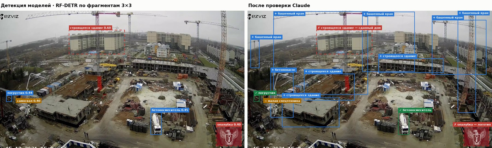
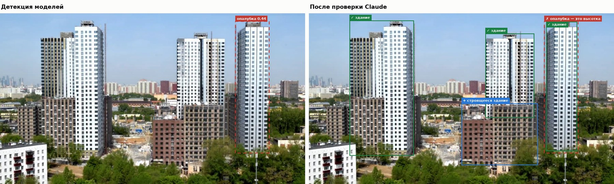

<details>
<summary>Примеры 2, 3, 5</summary>

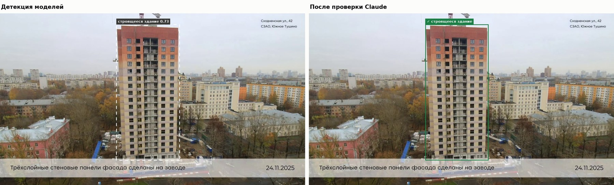
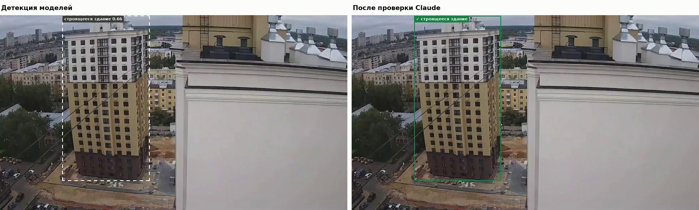
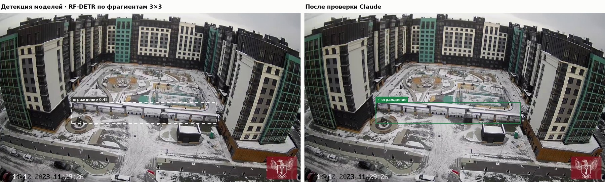

</details>

## Детектор техники

RF-DETR Large, 10 классов: экскаватор, самосвал, погрузчик, кран-манипулятор, автокран, бетоносмеситель,
бульдозер, грейдер, башенный кран, буровая установка. mAP50 **0.907**, mAP50-95 **0.767**, precision **0.938**.

На общих планах с высоты техника мелкая, поэтому для таких камер детектор работает **по фрагментам кадра**:
кадр целиком плюс сетка 3×3 перекрывающихся фрагментов. С фрагментов берутся только мелкие рамки (меньше 2%
площади кадра), крупные объекты находит проход по целому кадру; всё сливается через NMS. Включается на камеру
в `config.yaml` (`videos.video4.mp4: {tiles: 3}`); на video4 так находятся бетоносмеситель и погрузчик.

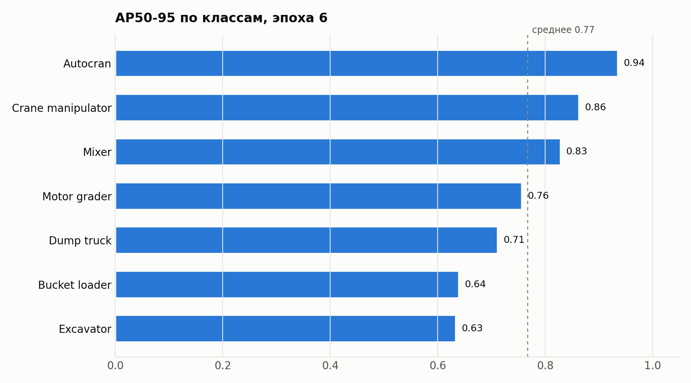

## Запуск

```bash
pip install torch torchvision --index-url https://download.pytorch.org/whl/cu128
pip install -r training/requirements.txt

python training/00_prepare_frames.py     # видео → кадры и метки
python training/01_build_features.py     # признаки DINOv2 и RF-DETR, ~12 мин на RTX 4090
python training/02_train_head.py         # обучение головы, < 1 мин
python training/03_predict.py --demo 10  # панели в predictions/<дата>/
python training/04_report.py             # итоговые графики и примеры для README
```

Веса детектора — `weights/rfdetr_large_best_ema.pth`, таймлапсы — `videos for train/`.
Подробности и все флаги — в [training/README.md](training/README.md).

## Структура

```
training/            код обучения и предсказания, config.yaml
predictions/         прогон предсказаний: карты внимания, кадры, JSON, CSV
docs/
├─ assets/           графики и примеры для README
├─ claude_review.json проверка кадров
└─ metrics_by_video.csv
weights/             веса RF-DETR (не в git)
videos for train/    таймлапсы (не в git)
```

## Статус и развитие

- **Энкодер сцены — DINOv2 ViT-g** с открытыми весами. DINOv3 подключается одной строкой в `config.yaml`
  (`backbone.name`), код поддерживает оба.
- **OCR даты пока не дообучен.** EasyOCR читает дату не на всех камерах (на video2 и video4 дата на кадре
  есть, но распознаётся не всегда). Если даты нет, план считается по положению кадра в видео.
- Следующие шаги: дообучить RF-DETR на общих планах с высоты (башенные краны, бетононасосы) по разметке
  из проверки, добавить класс «бетононасос», задать реальные плановые даты этапов вместо доли срока.

## Требования к оборудованию

Весь пайплайн обучен и проверен на **NVIDIA RTX 4090 (24 ГБ)**. Самый требовательный шаг — независимая проверка
Qwen3-VL 8B в bf16 (~17 ГБ видеопамяти); она загружается после выгрузки DINOv2 и отключается флагом `--no-vlm`.

| | минимум для всего пайплайна | без Qwen3-VL (`--no-vlm`) |
|---|---|---|
| **GPU** | NVIDIA 24 ГБ: RTX 3090 / 4090, A5000, L4 | NVIDIA 8 ГБ: RTX 3060 Ti / 4060 и выше |
| **Оперативная память** | 32 ГБ | 16 ГБ |


# [BACKEND](https://github.com/Antonoof/Intelligent-construction-site-monitoring-system/tree/main/backend)

# [FRONTEND](https://github.com/Antonoof/Intelligent-construction-site-monitoring-system/tree/main/frontend)
| **Диск** | 35 ГБ свободно | 15 ГБ свободно |
| **ПО** | драйвер NVIDIA ≥ 570 (CUDA 12.8), Python 3.10+, Windows или Linux | то же |
