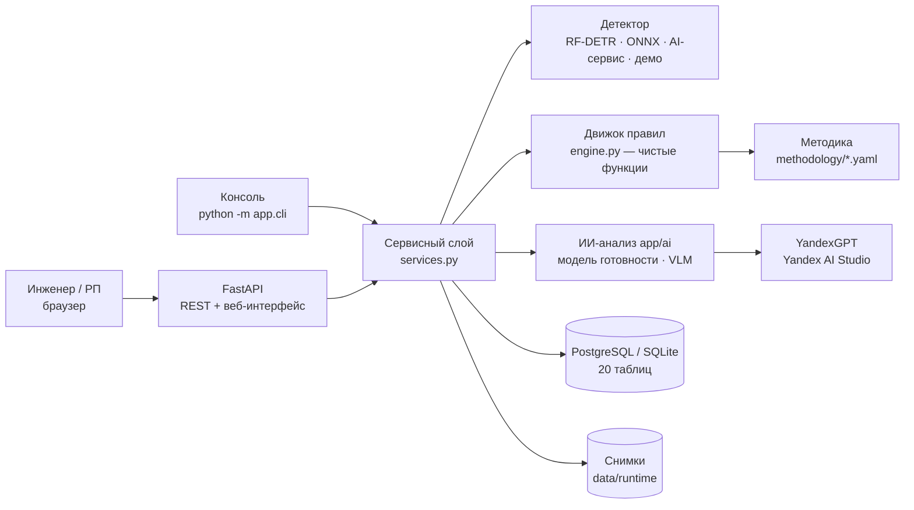
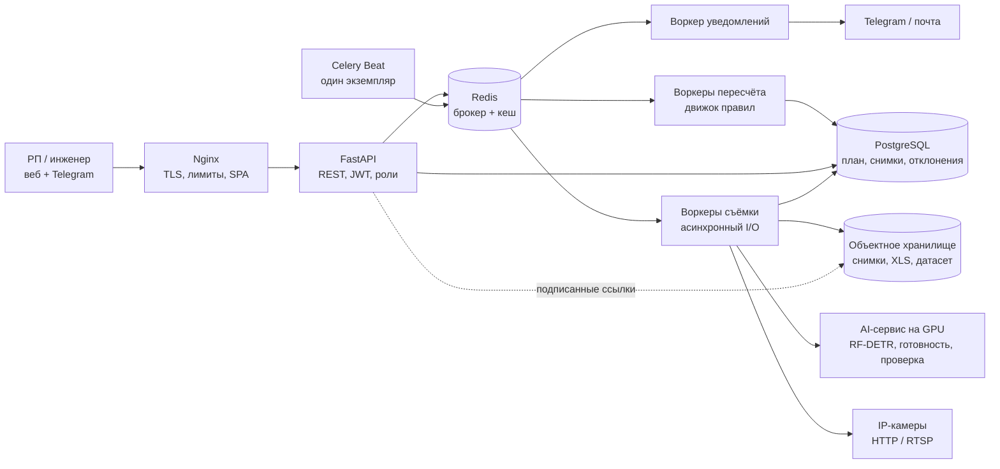
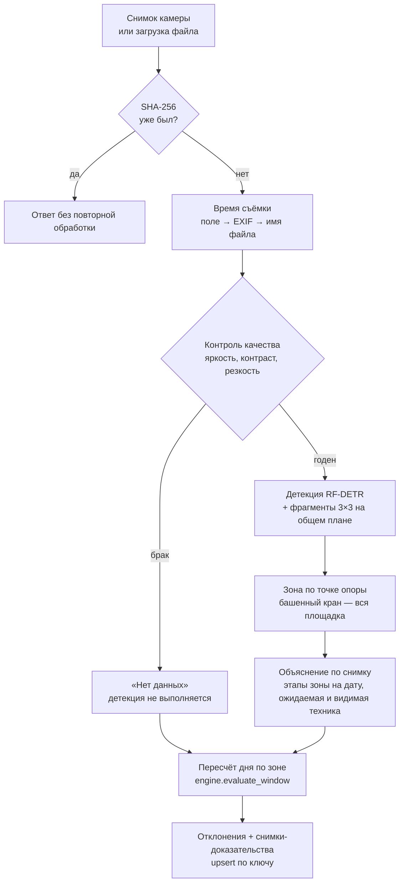
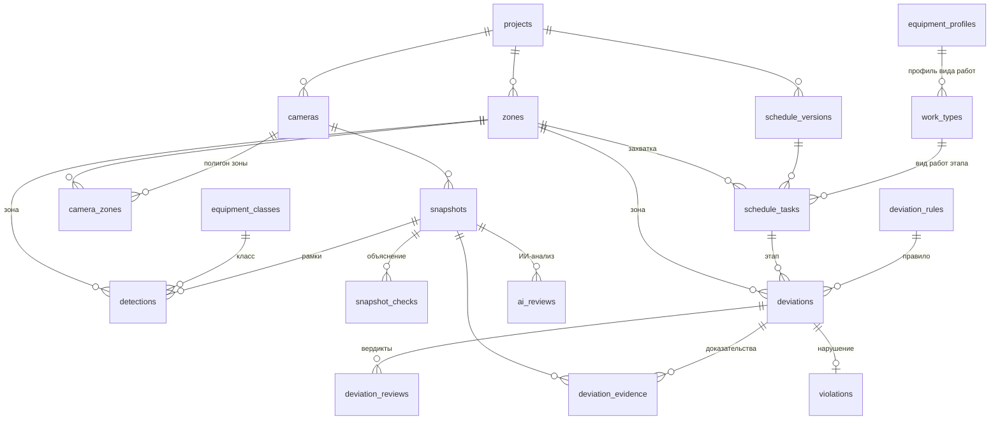

# ОКО — поиск нарушений на стройплощадках: архитектура

Сервис превращает снимки с камер в отклонения от календарного графика: находит технику, относит её к зоне и этапу
графика по методике «этап работ → необходимая техника» и объясняет каждое предупреждение — зона, этап, какая техника
ожидалась и какая видна, снимки-доказательства. Инженер подтверждает отклонение — оно становится нарушением в реестре.
Документ описывает прототип, который запускается на ноутбуке без GPU, и промышленную схему на 500 объектов и
4 000 камер. Сценарии — в [UML](UML-CONSTRUCTION-MONITORING.puml) ([SVG](UML-CONSTRUCTION-MONITORING.svg)).

## 1. Задача и допущения

Постановка — ТЗ «Автоматизированный сервис поиска нарушений на строительных площадках Москвы» (Департамент
градостроительной политики, 2026). Обязательные функции и где они в решении:

| Функция ТЗ | Решение |
| --- | --- |
| Обнаружение и классификация техники | RF-DETR Large из ML-части: 10 классов, mAP50 0,907; версия v2 добавляет каток и грузовик из перечня ТЗ по открытым датасетам организаторов (`training/05–08`) |
| Сопоставление с графиком | Методика: 377 видов работ справочника организаторов → 46 профилей техники; строка графика → вид работ (по коду или названию) → профиль → проверки на снимке ([methodology/](../methodology/README.md)) |
| Визуализация | Веб-интерфейс прототипа: сводка по зонам, снимки с рамками и объяснением, отклонения с доказательствами, график, методика, быстрая проверка снимка |
| Выявление отклонений | 10 правил: нет техники, нет нужной техники, неполный комплект (пример ТЗ), техники меньше плана, лишняя техника, опережение, затягивание этапа, техника вне графика, нет данных, стадия не совпадает |

| Допущение | Значение |
| --- | --- |
| Снимки | Стационарные камеры 1080p и выше; HTTP-снимок, кадр RTSP или загрузка файлов. Время снимка — из поля загрузки, EXIF или имени файла; дата на кадре (OCR ML-части) — запасной источник в промышленной схеме |
| Частота | В эксплуатации 1 снимок с камеры раз в 5 минут; прототип принимает и отдельные снимки — вывод по одному снимку помечается «предварительно» |
| Классы техники | Детектор v1 (веса команды) — 10 классов, из них 6 типов ТЗ; v2 после дообучения скриптами `training/05–08` — 12: экскаватор, самосвал, каток, кран-манипулятор, автобетоносмеситель, бульдозер, грузовик, автокран (все 8 типов ТЗ) + погрузчик, грейдер, башенный кран, буровая установка. План v3: автобетононасос, асфальтоукладчик |
| Зоны | Полигоны на кадре камеры = захватки графика. Машина относится к зоне по точке опоры; башенный кран — ко всей площадке |
| График | XLSX или CSV; столбцы по заголовкам: код, наименование, захватка, начало, окончание, техника (план), подрядчик |
| Стадии | S1 подготовка и котлован, S2 фундамент, S3 каркас, S4 фасад и сети, S5 отделка и благоустройство — как у модели готовности ML-части |
| Оборудование | Прототип — любой ноутбук: правила и API на CPU; детектор — RF-DETR на CPU (PyTorch или ONNX Runtime) или AI-сервис на GPU |

Вне рамок хакатона: охрана труда (каски, жилеты), расчёты с подрядчиками, объёмы работ в натуральных единицах.

## 2. Архитектура

### Прототип — один сервис



Движок — чистые функции без БД и ввода-вывода: на входе наблюдения зоны за окно и этапы графика, на выходе
отклонения и объяснение. Поэтому каждый вывод воспроизводим и покрыт тестами на сценариях (`backend/tests`).

| Модуль | Задача |
| --- | --- |
| `app/api/*` | REST: проекты, график, зоны и камеры, снимки, отклонения, нарушения, методика, быстрая проверка, контракт AI-сервиса |
| `app/services.py` | Сценарии: импорт графика, приём снимка, пересчёт отклонений за день, вердикт инженера, сводка |
| `app/engine.py` | Правила методики: окно зоны → отклонения + объяснение |
| `app/methodology.py` | Загрузка методики, синонимы классов, сопоставление строки графика со справочником |
| `app/schedule_io.py` | Разбор XLSX/CSV графика по заголовкам, иерархия этапов, техника из графика |
| `app/detection/*` | Детекторы: RF-DETR (PyTorch), ONNX Runtime на CPU, удалённый AI-сервис, демо-разметка; детекция по фрагментам |
| `app/imaging.py` | Время съёмки, контроль качества, превью и разметка для доказательств |
| `app/zones.py` | Точка опоры → зона |
| `app/models.py` | Модель данных (раздел 7) |
| `app/ai/*` | ИИ-анализ: модель готовности (инференс), локальная VLM, клиент YandexGPT / Claude / ChatGPT, сбор контекста, сведение слоёв и исправления, фоновые задачи |

### Промышленная схема

Один код обслуживает API и все воркеры — модульный монолит. Отдельно работает только AI-сервис: ему нужны GPU и свои
зависимости. Этот же код прототипа запускается как AI-сервис (`OKO_DETECTOR=rfdetr`, эндпоинт `/internal/detect`), а
основной сервис обращается к нему с `OKO_DETECTOR=http`.



| Компонент | Технологии | Задача |
| --- | --- | --- |
| Nginx | nginx | TLS, лимит размера файлов, ограничение частоты запросов, раздача интерфейса |
| API | FastAPI, SQLAlchemy, Alembic | REST, разбор графика, проверка отклонений, дашборд |
| Celery Beat | Celery, строго один экземпляр | Съёмка со сдвигом по камерам, пересчёт дня, раннее предупреждение в 11:00 |
| Воркеры | очереди `capture`, `recompute`, `notify`, `backfill` | Съёмка и детекция, пересчёт отклонений зоны за день, уведомления с дедупликацией, догон после сбоев |
| AI-сервис | PyTorch на GPU: RF-DETR Large, DINOv2 ViT-g с головой, Grounding DINO, Qwen3-VL 8B, EasyOCR | Техника на каждом снимке; стадия, готовность и дата по кадру общего плана; независимая проверка |
| PostgreSQL | партиции по дням для `snapshots` и `detections` | Методика, график, снимки, отклонения, нарушения, журнал проверки |
| Хранилище | S3 API: MinIO локально, Yandex Object Storage в облаке | Снимки, исходные графики, снимки-доказательства, датасет для дообучения |

## 3. Что изменилось под ТЗ

| # | Было | Стало | Зачем |
| --- | --- | --- | --- |
| 1 | Справочник «вид работ → техника» — 3 примера | Методика на все 377 видов работ справочника организаторов: 46 профилей, наблюдаемость, стадии, замечания экспертов | Главное требование ТЗ — явная и проверяемая связь техники с этапами |
| 2 | Статусы этапа по машино-часам за смену (R0–R5) | 10 правил по снимкам с окном подтверждения: вывод уже по одному снимку («предварительно»), серия — «подтверждено» | Организаторы дают отдельные снимки, а не видеопоток; предупреждение нужно сразу |
| 3 | 10 классов детектора | Детектор v2 — 12 классов: + каток и грузовик из перечня ТЗ; датасеты — из ссылок организаторов, скрипты дообучения `training/05–08` (до обучения работает v1) | Полный перечень техники ТЗ |
| 4 | Отсутствие техники без учёта «пары» | Парные правила: экскаватор → самосвал, миксер → насос или кран, грейдер → каток | Пример из ТЗ: экскаватор без самосвалов — снижение темпа |
| 5 | Лишняя техника — «опережение / вне графика» одним статусом | Опережение, затягивание этапа, техника вне графика, техника в зоне без работ — раздельно, с этапом-источником | Предупреждение объясняет причину |
| 6 | GPU от 8 ГБ обязателен | Правила и API на CPU; детектор на CPU через PyTorch или ONNX Runtime; GPU — по желанию | ТЗ: демонстрация на стандартных ноутбуках |
| 7 | Архитектура без кода | Работающий прототип: FastAPI, PostgreSQL/SQLite, Docker Compose, веб-интерфейс, консоль, 70 автотестов | ТЗ: прототип, доступный жюри, и Docker |
| 9 | Независимая проверка кадров Qwen3-VL и Claude — только в ML-части | ИИ-анализ в сервисе: модель готовности, VLM под доступную память и YandexGPT сверяют все слои; исправления — кнопкой инженера | Ошибки детектора и правил видны и исправляются до вердикта |
| 8 | Отклонение → уведомление | Отклонение → вердикт инженера → нарушение с номером, подрядчиком и сроком | «Поиск нарушений» в названии задачи |

Сохранены все решения прежней версии: снимок распознаётся один раз, «нет данных» ≠ «нет техники», максимум по
камерам зоны вместо суммы, идемпотентность по ключам, версии графика, проверка инженером до уведомления РП.

## 4. Конвейер снимка



| Шаг | Правило |
| --- | --- |
| Время | Поле загрузки → EXIF DateTimeOriginal → имя файла (`CAM-01_2026-09-24_10-30.jpg`) → время загрузки. Дата на кадре (OCR EasyOCR в ML-части) — запасной источник в промышленной схеме |
| Контроль качества | Средняя яркость 0,12–0,93, контраст ≥ 0,035, дисперсия лапласиана ≥ 25 на кадре шириной 640 px. Пороги — `rules.yaml` |
| Детекция | Один проход на снимок; для камер общего плана — целиком + сетка 3×3: с фрагментов берутся только мелкие рамки (< 2 % кадра), всё сливается через NMS, как в ML-части |
| Зоны | Середина нижней стороны рамки внутри полигона зоны; если точка вне зон — центр рамки, затем зона камеры по умолчанию |
| Слоты | Снимки разных камер зоны в одном 5-минутном слоте — одно наблюдение, счёт по классу — максимум по камерам |

## 5. Методика и движок правил

Полное описание — [methodology/README.md](../methodology/README.md). Кратко:

- вид работ справочника → **профиль техники**: обязательная техника (на каждом снимке или за смену), парные правила,
  допустимая техника, наблюдаемость (высокая, средняя, низкая, не видно с камер);
- для зоны на день движок берёт идущие, предстоящие (21 день) и недавно завершённые (30 дней) этапы и проверяет
  правила; всё, что не нужно идущим этапам, — лишняя техника с объяснением, какому этапу она принадлежит;
- пороги асимметричны: «лишняя техника» — только уверенная рамка (≥ 0,5), «техники нет» — даже сомнительная (≥ 0,3);
- требования к технике, которую модель пока не распознаёт (бетононасос), видны, но не проверяются.

| Код | Отклонение | 1 снимок | Серия |
| --- | --- | --- | --- |
| NO_DATA | Нет данных | к сведению | к сведению |
| NO_EQUIPMENT | Работы не ведутся | внимание | критично |
| MISSING_REQUIRED | Нет необходимой техники | внимание | критично |
| INCOMPLETE_SET | Неполный комплект техники | внимание | внимание; критично, если парной техники не было весь день |
| INSUFFICIENT_COUNT | Техники меньше плана | внимание | критично |
| EARLY_START | Опережение графика | к сведению | к сведению |
| STAGE_OVERRUN | Этап не завершён в срок | внимание | внимание |
| UNEXPECTED_EQUIPMENT | Техника не соответствует этапу | внимание | внимание |
| NO_ACTIVE_STAGE | Техника в зоне без работ по графику | внимание | внимание |
| STAGE_MISMATCH | Стадия по снимку не совпадает с планом | внимание | внимание |

**Пример из ТЗ в карточке отклонения.** «Неполный комплект техники · Котлован, секция 1 · подтверждено серией ·
2 снимка 10:30–11:20. Экскаватор работает без самосвалов — грунт не вывозится, возможно снижение темпа работ. Этап
12.3.1 Устройство котлована: экскаватор есть, самосвал нет». Расчёт: снимков с экскаватором — 6, без самосвала — 2,
доля 0,33 ≥ 0,3; самосвалы за день появлялись, поэтому «внимание», а не «критично». Рекомендация: проверить логистику
самосвалов; при повторении — предупреждение подрядчику о снижении темпа.

### Следующий слой — темп и прогноз

Для этапов с потребностью в технике в графике из тех же фактов считаются машино-часы: каждый 5-минутный слот
добавляет «число машин × 5 мин». Из них — присутствие ρ и загрузка u за смену, индекс выполнения графика SPI и прогноз
окончания по темпу за 3 дня против резерва этапа (прежняя версия архитектуры; интерактивный макет —
`frontend/plan-fact-site-monitor.html`). Отклонения по снимкам дают ранний сигнал в тот же час, машино-часы — оценку
риска срыва срока.

```latex
\rho = \frac{\text{МЧ}_{\text{присутствие}}}{\text{МЧ}_{\text{план}} \cdot c} \qquad u = \frac{\text{МЧ}_{\text{работа}}}{\text{МЧ}_{\text{присутствие}}} \qquad \text{SPI} = \frac{\sum \text{МЧ}_{\text{работа}}}{\sum \text{МЧ}_{\text{план}}}
```

Готовность объекта 0–100 % и стадия S1–S5 по кадру общего плана (DINOv2 + голова, ML-часть) закрывают фасад и
отделку, где техники мало: правило STAGE_MISMATCH срабатывает, если модель видит стадию раньше плановой. Модель
готовности работает в сервисе (`app/ai/readiness.py`, только инференс) — для кадров общего плана в фоне при загрузке и
для любого снимка в ИИ-анализе; её может заменить AI-сервис ML-части (поле `assessment` контракта `/internal/detect`).
В демо-проектах стадия берётся из разметки: сцены синтетические.

### ИИ-анализ

Конвейер снимка (`app/ai/jobs.py`, фоновая задача, статус и шаг — в `ai_reviews`):

1. **Модель готовности** — DINOv2 ViT-g (заморожен) + голова из `training/runs/<прогон>/head.pt`: CLS и патчи,
   усреднённые до сетки 9×16, плюс 4 признака на класс по рамкам RF-DETR этого снимка (как `common.det_features`) →
   готовность, стадия, карта внимания. План — доля срока графика; статус — пороги `plan` из `training/config.yaml`
   (от +3 п.п. — опережение, до −3 — успеваем, до −8 — риск, ниже — отставание). Похожие кадры обучения (`train_embed.npy`, как `neighbors` в `03_predict.py`) дают
   вторую оценку готовности.
2. **Контекст** (`app/ai/context.py`) — всё, что знают слои: качество, рамки детектора в долях кадра с зонами, зоны
   камеры, этапы графика с профилями и итогами проверок, отклонения, стадия по модели и по графику, каталог классов.
3. **Локальная VLM** (`app/ai/vlm.py`) — описание сцены, техника с рамками (0–1000 → доли кадра), стадия, люди,
   условия. Модель выбирается под свободную память с учётом модели готовности: Qwen3-VL 8B (≈23 ГБ) → 4B (≈12 ГБ) →
   2B (≈6 ГБ) → SmolVLM2-500M (≈2 ГБ); не помещается ни одна — слой пропускается с объяснением.
4. **Сверка детектора и VLM** (`fusion.cross_check`) по IoU ≥ 0.3: совпали, спорный класс, только VLM, только детектор.
5. **LLM** (`app/ai/llm.py`): по умолчанию **YandexGPT** в Yandex AI Studio — OpenAI-совместимый API, ответ по
   JSON-схеме (если модель схему не принимает — `json_object`, затем обычный текст). Авторизация — API-ключ или IAM-токен
   сервисного аккаунта ВМ из сервиса метаданных. YandexGPT текстовая: о кадре она судит по слоям 1–4; модели, которые
   принимают изображения (Qwen3.6 в AI Studio, Claude, ChatGPT), получают ещё исходный кадр и кадр с рамками `#id`.
6. **Сведение** (`fusion.fuse_snapshot`): техника по классам — детектор / VLM / LLM и согласие; стадия — график /
   модель / VLM / LLM; вердикты по рамкам и отклонениям; исправления с флагом «применимо» (уверенность LLM ≥ 0.6).
   «Применить» — ложные рамки `is_rejected`, класс исправляется, пропущенная техника — новая рамка `source=llm` в зоне
   по точке опоры; затем `recompute_snapshot` и `recompute_day`. «Отменить» возвращает рамки и пересчитывает.

Анализ дня (`POST /api/projects/{id}/ai-summary`) отправляет в LLM доску зон, отклонения, оценки модели готовности,
итоги анализа снимков, историю по дням и ближайшие этапы; ответ — статус, риски с вероятностью, прогноз задержек,
ошибки моделей, рекомендации.

| Переменная | По умолчанию | |
| --- | --- | --- |
| `OKO_LLM_PROVIDER` | `off` | `yandex` · `anthropic` · `openai` |
| `OKO_LLM_MODEL` | `yandexgpt-5.1` | для yandex: `yandexgpt-5-lite`, `aliceai-llm`, `qwen3.6-35b-a3b` (с изображениями) или полный `gpt://…` |
| `OKO_YC_FOLDER_ID` | — | каталог Yandex Cloud для URI модели `gpt://<каталог>/<модель>` |
| `OKO_LLM_API_KEY` | — | API-ключ; для yandex без ключа берётся IAM-токен сервисного аккаунта ВМ |
| `OKO_LLM_BASE_URL` | по провайдеру | `https://ai.api.cloud.yandex.net/v1` для yandex; прокси или шлюз |
| `OKO_LLM_IMAGES` | `auto` | отправлять ли кадры в LLM: `auto` — если модель их принимает |
| `OKO_READINESS` | `auto` | `weights/readiness/<прогон>` · путь · `off` |
| `OKO_READINESS_DTYPE` | `float32` | `bfloat16` — вдвое меньше памяти |
| `OKO_VLM` | `off` | `auto` — под память · id модели Hugging Face · `off` |
| `OKO_AI_AUTO` | `0` | `1` — анализировать каждый новый годный снимок |
| `OKO_AI_APPLY` | `manual` | `auto` — применять исправления сразу после анализа |
| `OKO_AI_APPLY_MIN_CONF` | `0.6` | минимальная уверенность LLM для исправления |

Веса DINOv2 и VLM скачиваются при первом анализе или заранее: `python -m app.ai.prefetch`.

## 6. Проверка инженером, нарушения и уведомления

- **Вердикт по каждому отклонению**: подтвердить (→ нарушение), ложное срабатывание, форс-мажор. Подтверждённое
  отклонение регистрируется в реестре нарушений: номер `НР-2026-0001`, зона, этап, подрядчик из графика, срок
  устранения (по умолчанию 3 дня).
- **Ложное срабатывание** помечает рамки-доказательства как отклонённые (`detections.is_rejected`): они не участвуют
  в пересчёте. В промышленной схеме такие рамки выгружаются в набор для дообучения детектора.
- **Пересчёт не отменяет решений**: при новых снимках отклонение обновляется, а рассмотренное инженером не удаляется
  и не возвращается в работу.
- **Промышленная схема (в прототипе нет):** уведомления РП только о подтверждённых нарушениях высокой важности,
  непроверенные через 4 часа — с пометкой «не проверено», одно уведомление на пару «этап, правило»; раннее
  предупреждение в 11:00 по утренним снимкам — этап без техники с начала смены.

## 7. Данные и API

### Модель данных

20 таблиц в пяти группах. Методика хранится версионно: версия правил пишется в каждое отклонение.



| Группа | Таблица | Ключевые поля |
| --- | --- | --- |
| Методика | `equipment_classes` | key, name, in_tz, site_wide, models (версии детектора), color |
| | `object_types` | key, name — 9 типов объектов справочника |
| | `equipment_profiles` | id, observability, required, companions, allowed, not_detected (JSONB), is_composite |
| | `work_types` | id (`12.3.7-1`), code, name, level, parent_id, stage, profile_id, observability, object_types, expert_note |
| | `deviation_rules` | code, title, severity, confirmed_severity, message, recommendation, rules_version |
| Проект | `projects` | name, object_type, address, timezone |
| | `zones` | key, name, color — захватки графика |
| | `cameras`, `camera_zones` | source_url, is_overview, tiles, default_zone_id; полигоны зон в долях кадра |
| | `site_equipment` | заявленная техника: класс, зоны, период (башенный кран) |
| | `schedule_versions`, `schedule_tasks` | версия графика; этап: wbs, name, work_type_id, match_method, profile_id, zone_id, даты, is_summary, planned_equipment, contractor |
| Наблюдения | `snapshots` | camera_id, taken_at, time_source, sha256, качество, detector, assessment (стадия и готовность), processing_ms |
| | `detections` | snapshot_id, equipment_class, confidence, x1…y2, zone_id, source, is_rejected |
| | `snapshot_checks` | snapshot_id, zone_key, payload — объяснение сопоставления |
| Выводы | `deviations` | day, zone_id, task_id, rule_code, equipment_class, severity, status, message, metrics, first/last_seen, rules_version, review_status; UNIQUE (project_id, key) |
| | `deviation_evidence` | deviation_id, snapshot_id, detection_ids |
| | `deviation_reviews` | verdict, comment, reviewer — журнал только на добавление |
| | `violations` | number, deviation_id, zone_id, task_id, contractor, severity, status, due_date |
| ИИ-анализ | `ai_reviews` | kind (snapshot · day), status, step, vlm_model/vlm_output, llm_provider/llm_model/llm_output, context (что ушло в LLM), final (сведение), applied (исправления и отмена), токены, длительность |

### API прототипа

Полная схема — Swagger на `/docs`.

| Метод и путь | Назначение |
| --- | --- |
| `GET /api/health` | Версии методики и правил, детектор и его классы, БД |
| `GET /api/reference/equipment · profiles · work-types · rules` | Методика: классы, профили, 377 видов работ, правила |
| `GET /api/reference/methodology.xlsx` | Методика в XLSX — справочник организаторов + столбцы методики |
| `POST /api/projects` · `PUT /api/projects/{id}/site` | Проект; зоны, камеры с полигонами, заявленная техника |
| `POST /api/projects/{id}/schedule` · `GET …/schedule` | Загрузка графика (новая версия), этапы с видом работ и профилем |
| `PATCH /api/tasks/{id}` | Вручную привязать этап к виду работ или зоне |
| `POST /api/projects/{id}/snapshots` | Загрузка снимков: детекция, зоны, пересчёт; ответ с временем обработки и id отклонений |
| `GET /api/projects/{id}/snapshots` · `GET /api/snapshots/{id}` · `…/image` | Снимки, карточка с рамками и объяснением, изображение с разметкой |
| `GET /api/projects/{id}/summary?day=` | Сводка на день: KPI, доска зон, отклонения |
| `GET /api/projects/{id}/deviations` · `GET /api/deviations/{id}` | Отклонения с зоной, этапом, расчётом и доказательствами |
| `POST /api/deviations/{id}/review` | Вердикт инженера → нарушение |
| `GET /api/projects/{id}/violations` · `…/report?format=csv` | Реестр нарушений, отчёт |
| `POST /api/analyze` | Снимок + вид работ → техника, проверки, предупреждения, без проекта |
| `GET /api/ai/status` | Какие ИИ-слои включены: модель готовности, VLM (какая поместится в память), LLM |
| `POST /api/snapshots/{id}/ai-review` · `GET …/ai-review` | Запустить ИИ-анализ снимка (202, фоновая задача) · последний анализ |
| `GET /api/ai/reviews/{id}?full=1` | Анализ с контекстом, отправленным в LLM, и её ответом |
| `POST /api/ai/reviews/{id}/apply` · `…/revert` | Применить исправления LLM с пересчётом отклонений · отменить |
| `POST /api/projects/{id}/ai-summary?day=` · `GET …` | ИИ-анализ площадки за день: статус, риски, прогноз, ошибки моделей |
| `GET /internal/info` · `POST /internal/detect` | Контракт AI-сервиса |

Контракт детекции (AI-сервис ⇄ основной сервис):

```json
{
  "model_version": "rfdetr-large-12cls:rfdetr_large_v2_best",
  "boxes": [
    {"cls": "excavator", "conf": 0.91, "xyxy": [412, 288, 655, 470]},
    {"cls": "dump_truck", "conf": 0.84, "xyxy": [700, 310, 902, 455]}
  ],
  "assessment": {"stage": "S2", "readiness": 16.2},
  "recognized": true
}
```

`assessment` присылает AI-сервис ML-части для кадров общего плана; `recognized: false` — детектор не смог обработать
снимок (например, демо-детектор без весов и чужой снимок): такой снимок получает «нет данных», а не «техники нет».

## 8. Нагрузка и масштабирование

| Показатель | Демо: 1 объект, 6 камер | Масштаб: 500 объектов, 4 000 камер |
| --- | --- | --- |
| Снимков в секунду (раз в 5 минут) | 0,02 | 13,3 |
| Снимков в сутки | 1 728 | 1 152 000 |
| Объём снимков в сутки (JPEG 400 КБ) | 0,69 ГБ | 461 ГБ |
| Детекция | CPU ноутбука или 1 GPU | ≈ 10 GPU уровня RTX 4090 (снимок распознаётся один раз) |
| Приём снимка без детекции: качество, зоны, пересчёт дня зоны | ≈ 16 мс на снимок на CPU (медиана, демо) | горизонтально: воркеры `recompute` без состояния |

- **Скорость прототипа.** Приём снимка без детекции — около 16 мс (медиана на 31 демо-снимке): контроль качества, зоны, объяснение и пересчёт
  отклонений зоны за день. Детекция RF-DETR на GPU — доли секунды на кадр, на CPU ноутбука — порядка
  секунды (точное значение для своего ноутбука даёт `training/08_export_cpu.py`). Для 6 камер со снимком раз в
  5 минут хватает и CPU: 72 снимка в час.
- **Задержка предупреждения** — время обработки снимка: отклонение появляется сразу после его приёма, подтверждение —
  со вторым снимком серии.
- **Узкие места по порядку** — опрос камер, хранение снимков, брокер. Запись примерно в 60 раз интенсивнее чтения,
  поэтому усилия — в конвейер приёма, а чтение закрывает кеш дашборда.
- **AI-сервис и очереди** — реплики без состояния за балансировщиком, динамические пакеты. Тяжёлые модели сцены
  (DINOv2, Grounding DINO, Qwen3-VL) — только на кадрах общего плана раз в смену и на снимках-доказательствах.
- **Доступность и согласованность** — приём выбирает доступность: снимки копятся в хранилище, пока AI-сервис
  недоступен, и распознаются позже (`backfill`). Проверка отклонений выбирает согласованность.
- **Безопасность и персональные данные** — JWT и роли на проект, шифрование учётных данных камер, приватный бакет
  с подписанными ссылками, размытие людей до сохранения, хранение в российском регионе (152-ФЗ).
- **Мониторинг** — доля снимков «нет данных» по камере, возраст последнего снимка, длина очередей, загрузка GPU.
  Если счёт класса падает сразу на всех камерах — это сбой модели, а не объекта.

## 9. Демо и экономика

**Прототип.** `docker compose up --build` → http://localhost:8000. Два демо-проекта (лето и зима), 31 снимок,
все 10 типов отклонений, включая пример из ТЗ; сценарии — [data/demo/README.md](../data/demo/README.md).

**Сценарий показа (6 минут).**
1. Методика: справочник организаторов → профили техники; вид работ 12.3.1 и его правило.
2. График загружен: 17 строк, 16 сопоставлены со справочником, «Монтаж башенного крана» — вручную.
3. Сводка 24.09: 8 отклонений, 2 критичных; доска зон.
4. Пример ТЗ: котлован, экскаватор без самосвалов, 2 снимка-доказательства — «возможно снижение темпа работ».
5. Снимок с объяснением: ожидалось «экскаватор + самосвал», видно «экскаватор», пара нарушена.
6. Инженер подтверждает отклонение — нарушение НР-2026-0001 в реестре; бульдозер зимой отклоняет как ложное
   срабатывание (уборка снега).
7. «Проверить снимок»: жюри загружает свой снимок и выбирает вид работ.

**Экономика на один объект** (прежний расчёт, цифры условные): эффект — 351 тыс. ₽ в месяц против 40 тыс. ₽ затрат,
в 8,8 раза больше; в пессимистичном сценарии — 111 тыс. ₽, в 2,8 раза. Складывается из времени инженера,
неподтверждённых машино-часов и сокращения задержек: [презентация по экономике](../frontend/Экономика%20контроля%20стройки%20по%20камерам.pdf),
[калькулятор окупаемости](https://garyanikin.github.io/oko-landing/%D0%BE%D0%BA%D1%83%D0%BF%D0%B0%D0%B5%D0%BC%D0%BE%D1%81%D1%82%D1%8C-%D0%BA%D0%BE%D0%BD%D1%82%D1%80%D0%BE%D0%BB%D1%8F-%D1%81%D1%82%D1%80%D0%BE%D0%B9%D0%BA%D0%B8.html).

## Источники

- ТЗ «Автоматизированный сервис поиска нарушений на строительных площадках Москвы» и справочник видов работ организаторов.
- README ML-части — раздел «Детектор техники» корневого README.md и training/README.md: модели, классы, метрики, требования к оборудованию.
- [The System Design Primer](https://github.com/donnemartin/system-design-primer) — подход к разделу 8.
- [RF-DETR](https://github.com/roboflow/rf-detr) — детектор, обучение и экспорт в ONNX.
