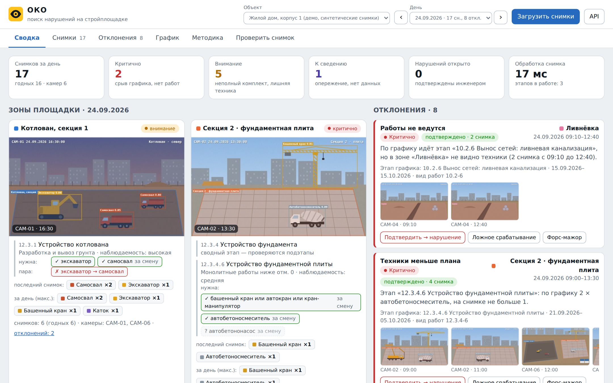
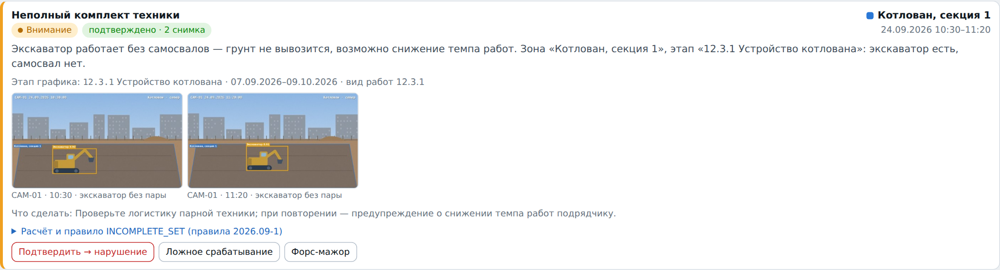
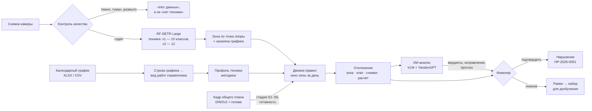
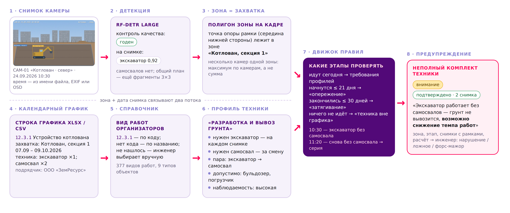
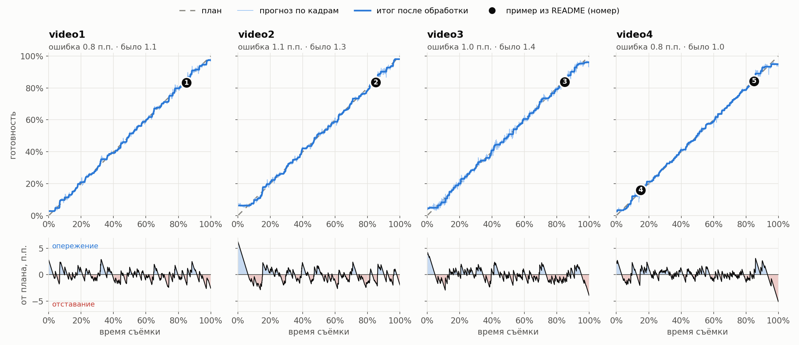

# ОКО — поиск нарушений на строительных площадках

Сервис берёт снимки с камер стройплощадки, находит на них **строительную технику**, относит её к **зоне и этапу
календарного графика** по методике «этап работ → необходимая техника» и выдаёт **отклонения с объяснением**: какая
техника ожидалась, какая видна, в какой зоне, на каких снимках. Инженер подтверждает отклонение — оно становится
нарушением в реестре. Решение для задачи Департамента градостроительной политики Москвы «Автоматизированный сервис
поиска нарушений на строительных площадках Москвы» (2026).



| 377 → 46 | 10 → 12 | 10 | 0.907 | ≈ 16 мс |
|:---:|:---:|:---:|:---:|:---:|
| видов работ справочника → профилей техники | классов детектора: v1 → v2 со всеми 8 типами техники ТЗ | правил отклонений | mAP50 детектора техники (v1) | приём снимка на CPU без детекции |

## Что требует ТЗ и где это в решении

| Функция ТЗ | Как сделано |
|---|---|
| **Обнаружение и классификация техники** | RF-DETR Large из ML-части: 10 классов, mAP50 0.907; для общих планов — детекция по фрагментам 3×3. Детектор v2 добавляет **каток и грузовик** из перечня ТЗ по открытым датасетам из ссылок организаторов ([training/](training/README.md)) |
| **Сопоставление с графиком** | [Методика](methodology/README.md) на все 377 видов работ справочника организаторов: строка графика → вид работ (по коду или названию) → профиль техники → проверки на снимке. Профиль задаёт обязательную технику, парную («экскаватор → самосвал»), допустимую и наблюдаемость работ с камер |
| **Визуализация результатов** | Веб-интерфейс: сводка по зонам, снимки с рамками и объяснением, отклонения со снимками-доказательствами, график, методика, проверка своего снимка. REST API со Swagger и консольное приложение |
| **Выявление отклонений** | 10 правил: нет техники, нет нужной техники, **неполный комплект (пример из ТЗ)**, техники меньше плана, техника не по этапу, опережение, затягивание этапа, техника в зоне без работ, нет данных, стадия по кадру не совпадает с планом |
| **Проверка и прогноз ИИ** | Выводы всех моделей и правил сводятся в один контекст и уходят в **YandexGPT** (Yandex AI Studio): вердикт по каждой рамке и каждому отклонению, пропущенная техника, стадия, прогноз и рекомендации; исправления инженер применяет одной кнопкой ([ниже](#ии-анализ-все-модели-и-слои--yandexgpt)) |

**Пример из ТЗ в работе.** На этапе «12.3.1 Устройство котлована» камера видит экскаватор без самосвалов на двух
снимках подряд. Система выдаёт «Неполный комплект техники» — зона «Котлован, секция 1», снимки 10:30 и 11:20 с
подсвеченной техникой, текст «Экскаватор работает без самосвалов — грунт не вывозится, возможно снижение темпа
работ» и рекомендацию.



## Как это работает





1. **Снимок** приходит загрузкой файла, через API или консоль. Время съёмки — из поля загрузки, EXIF или имени
   файла (`CAM-01_2026-09-24_10-30.jpg`).
2. **Контроль качества** до детекции: ночь, туман, засветка дают «нет данных» — зона не оценивается, ложного
   «работы не ведутся» нет.
3. **Детекция** RF-DETR по всему кадру; машина относится к зоне по середине нижней стороны рамки в полигоне зоны,
   размеченном для камеры. Снимок с другого ракурса (своё фото) загружается с режимом «весь кадр → зона»: полигоны
   не применяются, вся техника кадра относится к выбранной зоне; режим меняется и в карточке снимка. Снимки разных камер одной зоны в
   одном 5-минутном слоте — одно наблюдение: максимум по камерам, а не сумма.
4. **Сопоставление с графиком.** Для зоны на дату движок берёт идущие, предстоящие (21 день) и недавно завершённые
   (30 дней) этапы и проверяет требования их профилей. Всё, что не нужно идущим этапам, — лишняя техника с
   объяснением, к какому этапу она относится.
5. **Отклонение** по одному снимку — «предварительно», серия снимков дня — «подтверждено» (лишнюю технику
   подтверждает и одна очень уверенная рамка, ≥ 0.8). Каждое отклонение хранит
   расчёт, версию правил и снимки-доказательства с подсвеченными рамками.

Подробно: архитектура и модель данных — [backend/readme.md](backend/readme.md), сценарии — [UML](backend/UML-CONSTRUCTION-MONITORING.svg).

## Методика «этап работ → необходимая техника»

Методика — это данные, а не код: [methodology/](methodology/README.md), YAML + [XLSX для экспертов](methodology/Методика_этап_техника.xlsx).

| Наблюдаемость | Видов работ | Что проверяется |
|---|---:|---|
| высокая | 70 | котлован, сваи, засыпка, дороги: нет техники — нет работ; проверка по каждому снимку |
| средняя | 99 | подача бетона, монтаж, доставка: нужная техника хотя бы раз за смену |
| низкая | 70 | техника вспомогательная: проверяется только лишняя техника |
| не видно с камер | 138 | работы внутри здания и документы: только лишняя тяжёлая техника |

Замечания экспертов из справочника учтены явно: «монолитные работы ниже отметки 0 — как веха», «сложно отделять по
фото с дальнего расстояния», «важно разделять этапы фасада» — фасад разделяется по стадии на кадре общего плана.
Порог «лишней техники» — уверенная рамка (≥ 0.5), «техники нет» — даже сомнительная (≥ 0.3): сомнительная рамка не
создаёт тревоги ни в одну сторону.

## Детектор техники

RF-DETR Large, 10 классов: экскаватор, самосвал, погрузчик, кран-манипулятор, автокран, бетоносмеситель,
бульдозер, грейдер, башенный кран, буровая установка. mAP50 **0.907**, mAP50-95 **0.767**, precision **0.938**.

| Перечень ТЗ | v1 | v2 |
|---|:---:|:---:|
| самосвал, экскаватор, кран-манипулятор, бетоносмеситель, бульдозер, автокран | ✓ | ✓ |
| **каток, грузовик** | — | ✓ датасет №1 организаторов (CC0) |
| погрузчик, грейдер, башенный кран, буровая установка | ✓ | ✓ |

На общих планах с высоты техника мелкая, поэтому для таких камер детектор работает **по фрагментам кадра**: кадр
целиком плюс сетка 3×3 перекрывающихся фрагментов, с фрагментов берутся только мелкие рамки (меньше 2 % площади
кадра), всё сливается через NMS. Включается флагом камеры `tiles`.

Дообучение v2 и своя тестовая выборка по условиям съёмки (день, сумерки, ночь, зима, дальний и ближний план) —
`training/05–07`; экспорт в ONNX для ноутбука без GPU — `training/08`. Метрики v2 появятся после обучения; в
документации приведены только метрики v1.

## Готовность и стадия по кадру общего плана

Замороженные DINOv2 ViT-g и RF-DETR + обучаемая голова (2.6 млн параметров) по одному кадру общего плана определяют
стадию **S1–S5** и готовность объекта **0–100 %**. Средняя ошибка готовности — **0.9 п.п.**, точность стадии —
**99.7 %** на 4 692 кадрах четырёх таймлапсов. В сервисе это правило «Стадия по снимку не совпадает с планом»: оно
закрывает фасад и отделку, где техники мало. Стадии: **S1** подготовка и котлован · **S2** фундамент · **S3**
каркас · **S4** фасад и инженерные системы · **S5** отделка и благоустройство.

**В сервисе — только инференс** ([backend/app/ai/readiness.py](backend/app/ai/readiness.py)): из `training/runs/`
взяты голова и эмбеддинги обучающих кадров (`weights/readiness/20260925_212125/`, 13 МБ), DINOv2 ViT-g скачивается
с Hugging Face. Подключён прогон на 5 таймлапсах (5 892 кадра): на кадрах обучения ошибка готовности 1.2 п.п.,
стадия 99.7 %; отложенного видео в этом прогоне нет, поэтому на новых объектах ошибка будет выше. Кадры общего плана
оцениваются в фоне при загрузке, любой снимок — в ИИ-анализе. К стадии добавляется план по графику проекта
(доля срока от первого до последнего этапа) и статус «опережаем / успеваем / риск / отстаём» с отставанием в днях,
а карта внимания 9×16 показывается поверх снимка. Внешний AI-сервис по-прежнему может прислать стадию в поле
`assessment` контракта `/internal/detect`; в демо-проектах она берётся из разметки.



| видео | кадров | ошибка по кадрам | ошибка итога | точность стадии |
|---|---:|---:|---:|---:|
| video1 | 1 200 | 1.1 п.п. | **0.8 п.п.** | 99.6% |
| video2 | 1 200 | 1.3 п.п. | **1.1 п.п.** | 99.9% |
| video3 | 1 092 | 1.4 п.п. | **1.0 п.п.** | 99.6% |
| video4 | 1 200 | 1.0 п.п. | **0.8 п.п.** | 99.5% |
| **все** | **4 692** | **1.2 п.п.** | **0.9 п.п.** | **99.7%** |

Примеры панелей, карты внимания, проверка кадров Claude и Qwen3-VL — [training/README.md](training/README.md#результаты-ml-части),
исходный вывод моделей — `predictions/`.

## ИИ-анализ: все модели и слои → YandexGPT

Кнопка «Анализ ИИ» в карточке снимка проекта и на вкладке «Проверить снимок» (свой снимок без проекта) запускает конвейер в фоне ([backend/app/ai/](backend/app/ai/__init__.py)):

| Слой | Что даёт | Где работает |
|---|---|---|
| RF-DETR | рамки техники по классам | сервис, CPU |
| Правила методики | этапы графика по зонам, проверки, отклонения | сервис |
| Модель готовности | стадия S1–S5, готовность %, план по графику, отставание в днях | сервис, CPU ≈ 30 с |
| Локальная VLM | описание сцены, техника с рамками, стадия, люди, условия | сервис: Qwen3-VL **8B → 4B → 2B** или SmolVLM2-500M — самая крупная, что помещается в память |
| Сверка детектора и VLM | совпали · спорный класс · только VLM · только детектор (по IoU рамок) | сервис |
| **YandexGPT** | вердикт по каждой рамке и каждому отклонению, пропущенная техника, стадия, новые находки, прогноз, рекомендации | Yandex AI Studio, JSON по схеме |

YandexGPT не принимает изображения, поэтому «глаза» конвейера — детектор, модель готовности и VLM, а YandexGPT
сопоставляет их выводы с графиком и методикой. С моделью `qwen3.6-35b-a3b` из AI Studio (`OKO_LLM_MODEL`) в запрос
уходят и сами кадры; Claude и ChatGPT подключаются так же (`OKO_LLM_PROVIDER=anthropic|openai`).

Итог показывается в карточке: техника по слоям с расхождениями, стадия по графику, модели, VLM и YandexGPT, вердикты
и прогноз. «Применить исправления» исключает ложные рамки, исправляет класс и добавляет пропущенную технику
(источник «добавлено ИИ»), после чего правила пересчитываются по снимку и дню; «Отменить» возвращает всё как было.
Исправление применяется, только если уверенность YandexGPT не ниже 0.6. На сводке «Анализ ИИ за день» — статус
площадки, риски срыва сроков с вероятностью, прогноз задержек по этапам и где модели, вероятно, ошиблись. Всё, что
ушло в LLM, и её ответ сохраняются (`ai_reviews`) и открываются по ссылке — любой вывод можно перепроверить.

**Скорость без потери качества.** Модели загружаются в память сразу после старта сервиса; модели на CPU и запрос
к LLM идут в разных потоках — пока LLM отвечает по одному кадру, модели считают следующий; выводы модели готовности
и VLM кешируются по содержимому
кадра, поэтому повторный анализ и анализ кадра общего плана, оценённого при загрузке, заново вызывают только LLM.
Время каждого слоя видно в карточке.

Включение — переменные окружения ([backend/readme.md](backend/readme.md#ии-анализ)); в Yandex Cloud сервисный аккаунт ВМ
получает роль `ai.languageModels.user`, и ключ API не нужен ([deploy/yandex-cloud](deploy/yandex-cloud/README.md)).

## Запуск

**Docker — одна команда, ноутбук без GPU:**

```bash
git clone https://github.com/Antonoof/Intelligent-construction-site-monitoring-system.git
cd Intelligent-construction-site-monitoring-system
docker compose up --build
```

Откройте http://localhost:8000 — интерфейс; http://localhost:8000/docs — Swagger. PostgreSQL поднимается рядом,
демо-проекты загружаются при первом старте.

**Без Docker** (Python 3.10+): `scripts/run_local.sh` (Linux, macOS) или `scripts\run_local.bat` (Windows) — виртуальное
окружение, зависимости, SQLite, сервис на :8000.

**Детектор.** Без весов сервис работает на эталонной разметке демо-проектов. Реальные снимки распознаются, если
подключить веса ([weights/](weights/README.md)):

| Режим | Как включить | Где работает |
|---|---|---|
| RF-DETR на PyTorch | `pip install -r backend/requirements-ml.txt`, `OKO_DETECTOR=rfdetr` | CPU или GPU |
| RF-DETR в ONNX | `python training/08_export_cpu.py`, `OKO_DETECTOR=onnx` | CPU без PyTorch; в Docker подхватывается сам |
| AI-сервис на GPU | `OKO_DETECTOR=http docker compose --profile gpu up --build` | основной сервис на CPU, детекция на GPU |

**Публичное демо в Yandex Cloud** — ВМ без GPU, RF-DETR, модель готовности и VLM на CPU, YandexGPT в AI Studio,
две команды ([deploy/yandex-cloud](deploy/yandex-cloud/README.md)):

```bash
deploy/yandex-cloud/create-vm.sh           # ВМ 4 vCPU / 16 ГБ, сервисный аккаунт для YandexGPT, Docker
deploy/yandex-cloud/deploy.sh <IP>         # код и веса на ВМ, сборка, запуск → http://<IP>
```

ВМ уже создана с 8 ГБ — `deploy/yandex-cloud/upgrade-vm.sh <имя ВМ>`, затем `deploy.sh`.

**Консоль** (из `backend/`):

```bash
python -m app.cli check ../data/demo/housing/snapshots/CAM-01_2026-09-24_10-30.jpg -w 12.3.1 --planned "Экскаватор ×1; Самосвал ×2"
python -m app.cli rules 12.3.1          # правила методики для вида работ
python -m app.cli report --project 1 --day 2026-09-24 --csv отчёт.csv
```

**Тесты** — 80 проверок сервиса, включая все демо-сценарии и ИИ-конвейер с подменой YandexGPT:

```bash
cd backend && python -m unittest discover -s tests
python -m unittest discover -s training/tests      # из корня репозитория
```

**Сценарий показа (6 минут):** методика → загруженный график → сводка 24.09 → пример из ТЗ → снимок с объяснением →
вердикт инженера и реестр нарушений → «Проверить снимок» со своим файлом. Демо-сценарии — [data/demo/](data/demo/README.md).

## Документы

| Документ | Файл |
|---|---|
| Сопроводительная документация (ТЗ, раздел 5) | [docs/ОКО_документация.pdf](docs/ОКО_документация.pdf) · [.docx](docs/ОКО_документация.docx) |
| Краткое описание решения, 2 страницы (ТЗ, 7.1) | [docs/ОКО_краткое_описание.pdf](docs/ОКО_краткое_описание.pdf) · [.docx](docs/ОКО_краткое_описание.docx) |
| Презентация (ТЗ, раздел 4) | [docs/ОКО_презентация.pptx](docs/ОКО_презентация.pptx) · [.pdf](docs/ОКО_презентация.pdf) |
| Рекомендации по установке камер | [docs/camera_recommendations.md](docs/camera_recommendations.md) |
| Архитектура, модель данных, API, масштабирование | [backend/readme.md](backend/readme.md) |

## Структура

```
backend/             сервис: FastAPI, движок правил, детекторы, БД, консоль, тесты, Dockerfile
frontend/app/        интерфейс прототипа (отдаётся бэкендом)
frontend/            лендинг, макет «план-факт», экономика
methodology/         методика «этап → техника»: YAML, XLSX, справочник организаторов
training/            ML: готовность и стадия (0–4), детектор v2 и экспорт для CPU (5–8)
data/demo/           демо-проекты: графики, камеры и зоны, снимки с разметкой
docs/                документация, презентация, рекомендации по камерам, иллюстрации
tools/               сборка методики и демо-данных
weights/             веса моделей (не в git), кроме головы модели готовности — weights/readiness/
docker-compose.yml   PostgreSQL + сервис; профиль gpu — AI-сервис с RF-DETR
deploy/yandex-cloud/ публичное демо с RF-DETR и ИИ-анализом (YandexGPT) на ВМ Yandex Cloud
```

## Условия и ограничения

- **Детектор v1** — веса ML-части команды (10 классов, метрики выше). **v2** дообучается от v1 на открытых датасетах
  из ссылок организаторов (источники и лицензии — [training/datasets.yaml](training/datasets.yaml)).
- **Бетононасос и асфальтоукладчик** пока не распознаются: требования с ними видны в карточке этапа, но в проверку не
  входят — ложных «нет насоса» нет. Классы запланированы в v3.
- **Демо-снимки синтетические** (ТЗ, раздел 6.2, это допускает), рамки на них — эталонная разметка. На реальных
  снимках работает RF-DETR с весами команды; без весов чужой снимок получает «нет данных», а не ложное
  «работы не ведутся».
- **Каток и грузовик** распознаёт детектор v2 — его обучают скрипты `training/05–06`; до обучения работает v1
  (6 из 8 типов техники ТЗ), и правила с катком и грузовиком автоматически не проверяются.
- **Стадия и готовность** считаются моделью готовности в самом сервисе, если установлены PyTorch и transformers
  (образ `Dockerfile.ai`); на CPU это ≈30 с на кадр, поэтому оценка идёт в фоне. Без них стадию может прислать
  AI-сервис ML-части.
- **ИИ-анализ** — подсказка инженеру, а не решение: исправления YandexGPT применяются кнопкой и отменяются, всё
  отправленное в LLM сохраняется. VLM на CPU отвечает за 1–2 минуты; без 16 ГБ памяти крупные слои пропускаются.
- **Логика сопоставления** настроена на все 377 видов работ справочника; по технике проверяются 169 видов с высокой и
  средней наблюдаемостью, остальные — только на лишнюю технику.

## Требования к оборудованию

| | Сервис и правила | + RF-DETR на CPU | + ИИ-анализ на CPU | Весь ML-пайплайн |
|---|---|---|---|---|
| **GPU** | не нужен | не нужен | не нужен | NVIDIA 24 ГБ: RTX 3090 / 4090, A5000, L4 (без Qwen3-VL — от 8 ГБ) |
| **Оперативная память** | 2 ГБ | 8 ГБ | 16 ГБ (Qwen3-VL-2B), 32 ГБ (4B) | 32 ГБ |
| **ПО** | Docker или Python 3.10+ | + ONNX Runtime или PyTorch CPU | + transformers; YandexGPT — доступ к Yandex AI Studio | драйвер NVIDIA ≥ 570 (CUDA 12.8), Python 3.10+ |

# [BACKEND](backend/readme.md)

# [FRONTEND](frontend/readme.md)
